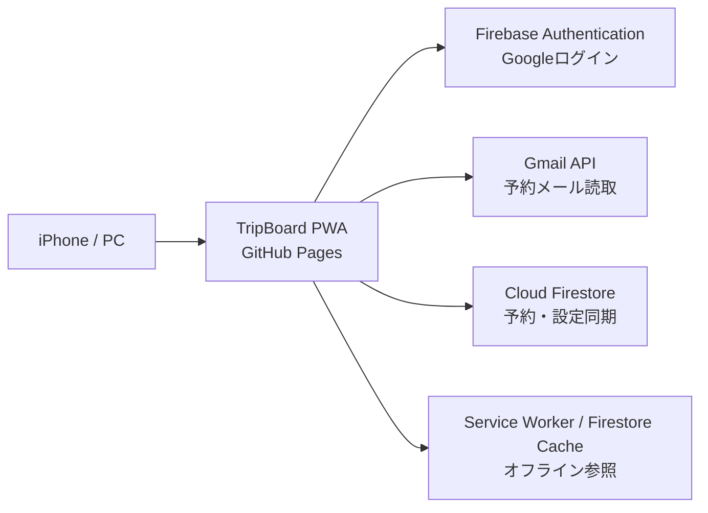

# TripBoard アプリ仕様書

## 1. 文書情報

| 項目 | 内容 |
| --- | --- |
| アプリ名 | TripBoard |
| 目的 | Gmailに届く出張予約メールを解析し、航空券とホテルを出張単位で確認できるようにする |
| 主対象端末 | iPhone |
| アプリ形態 | GitHub Pagesで配信するPWA |
| 対象利用者 | アプリ所有者本人 |
| 対象バージョン | 公開版 `v10` |
| 基準日 | 2026年6月15日 |
| 公開URL | https://kobasho-unihota.github.io/myportfolio/apps/trip-dashboard/ |

本書は、当初計画と2026年6月15日時点の実装を照合した現行仕様書である。将来要件ではなく、特記がない限り現在のコードで動作する内容を記載する。

## 2. プロダクト概要

TripBoardは、JAL国内線と楽天トラベルの予約メールをGmailから読み込み、次の出張をiPhoneで素早く確認するための個人用ダッシュボードである。

主な利用目的は以下のとおり。

- 次の出張の日程、往復便、ホテルを一画面で確認する
- 予約変更、座席変更、取消メールを同じ予約へ統合する
- メールから取得できなかった情報を手動で補正する
- iPhoneとPCの間で予約情報と手修正内容を同期する
- オフライン時も保存済みの予約を参照する

### 2.1 システム構成



Gmail本文の取得と解析はブラウザ内で行う。専用バックエンドサーバーは使用しない。

## 3. 対象範囲

### 3.1 対応対象

| 種別 | 対応事業者 | 対応内容 |
| --- | --- | --- |
| 航空券 | JAL国内線 | 予約内容、搭乗案内、座席変更、遅延、取消を解析・統合 |
| ホテル | 楽天トラベル | 予約完了、予約確認、キャンセル確認を解析・統合 |
| 手動予約 | 任意 | 航空券またはホテルを手入力 |

### 3.2 対象外

- JAL国際線
- JAL以外の航空会社を単独便名として扱う予約
- 楽天トラベル以外のホテル予約サイト
- 新幹線、在来線、バス、レンタカー
- 経費精算
- カレンダー連携
- プッシュ通知
- 複数ユーザーでの旅行共有
- 一般公開サービスとしての利用者管理

## 4. 画面仕様

下部ナビゲーションは以下の4画面で構成する。

### 4.1 次の出張

次回の出張を最優先で表示する。

表示項目:

- 出張先
- 出張期間
- 出発までの日数
- 往路の出発地、到着地、出発時刻、到着時刻
- 便名
- 予約件数
- 航空券とホテルの時系列
- 不足情報に関する警告
- 2件目以降の出張予定

警告条件:

- 航空券が存在しない
- 復路便が存在しない
- 複数日の出張にホテルが存在しない
- 航空券の日時、出発地、到着地が不足している
- ホテル名、チェックイン、チェックアウトが不足している

終了から12時間以内の出張は、出張中または直近の出張として表示対象に含める。

### 4.2 予約一覧

予約を以下のフィルターで表示する。

| フィルター | 表示条件 |
| --- | --- |
| 予定 | 取消されておらず、非表示でなく、前日以降の予約 |
| すべて | 保存されている全予約 |
| 取消 | `status` が `cancelled` の予約 |

予約ごとに以下の操作を提供する。

- 内容編集
- 非表示・再表示
- 元メールをGmailで表示
- 手動予約の追加

### 4.3 更新

以下の2種類の同期を提供する。

#### 通常更新

- 初回は過去12か月を検索する
- 2回目以降は最終同期日時の30日前から再検索する
- 新規メールと変更メールを既存予約へ統合する
- 変更のあった予約だけFirestoreへ保存する
- 完了後に `lastSyncedAt` を更新する

#### 全予約を完全再取得

- 楽天トラベルは過去2年を検索する
- JAL国内線は過去1年を検索する
- 事業者ごとに予約を再構築する
- 同一予約の確認、変更、取消メールを統合する
- 既存の手修正値と非表示状態を維持する
- 楽天メールが0件、またはホテル解析結果が0件の場合は処理を中断する
- 中断時は既存ホテル予約を削除しない
- 成功時は楽天メール検索件数、ホテル件数、航空券件数を表示する

同期中は検索、本文取得、保存の進捗件数を表示する。

### 4.4 設定

設定項目:

- 自宅空港
- Googleアカウントへのログイン・ログアウト
- 非表示予約の一括再表示

自宅空港の初期値は `福岡` とする。

## 5. 認証・認可仕様

### 5.1 Firebase認証

- Google認証を使用する
- ログインしたGoogleアカウントのUID配下へデータを保存する
- Firestoreルールで、本人のUID配下だけ読み書きを許可する
- Googleアカウント選択画面はログイン時に毎回表示する

### 5.2 Gmail認可

- Gmail取得時に `https://www.googleapis.com/auth/gmail.readonly` を要求する
- Gmailへの書き込み、送信、削除は行わない
- GmailアクセストークンはJavaScriptのメモリ内だけに保持する
- アクセストークンをFirestore、Local Storage、IndexedDBへ明示的に保存しない
- 認証期限切れの場合は、再度更新操作を行って認可する

### 5.3 本人専用制約

現行実装は、ログインしたユーザーごとにFirestore領域を分離する。特定メールアドレスだけを許可する所有者ホワイトリストは実装していない。

一般公開する場合は以下が別途必要となる。

- Google OAuth同意画面の公開設定
- Gmail制限付きスコープに関するGoogleの審査
- プライバシーポリシー
- 利用規約
- 所有者以外の利用を許可する場合の運用設計

## 6. Gmail取得仕様

### 6.1 API

- Gmail API `users.messages.list` で対象メールIDを検索する
- Gmail API `users.messages.get` の `format=full` で本文を取得する
- 1回に10件ずつ並列取得する
- 1回の同期で最大500メールまで取得する
- 迷惑メールとゴミ箱は検索対象外とする

### 6.2 本文選択

multipartを再帰走査し、すべての `text/plain` と `text/html` パートを取得する。本文が `attachmentId` で返された場合はGmail添付本文APIから取得する。

プレーンテキスト、HTMLテキスト、両者を結合した本文を一時的な候補として保持し、予約番号、施設名、チェックインなどの取得項目が最も多い本文を楽天解析に使用する。

文字コードはメールパートの `charset` を参照して `TextDecoder` で変換する。HTML内のリンクは、リンク文字列とURLを保持したテキスト形式へ変換する。

### 6.3 検索条件

通常更新では、JAL関連送信元、楽天トラベル関連送信元、件名キーワードを組み合わせて検索する。

完全再取得では以下を対象とする。

- 楽天トラベル:
  - `travel@mail.travel.rakuten.co.jp`
  - `no-reply@mail.travel.rakuten.co.jp`
  - 予約完了メール
  - 予約確認メール
  - キャンセル確認メール
- JAL:
  - `jal.com`
  - `skyinfo.jal.com`
  - `booking.jal.com`
  - 件名に `JAL国内線`

## 7. 予約解析仕様

### 7.1 共通項目

すべての予約は以下の共通構造を持つ。

| 項目 | 型 | 内容 |
| --- | --- | --- |
| `id` | string | 予約を一意に識別するID |
| `type` | string | `flight` または `hotel` |
| `provider` | string | `JAL`、`楽天トラベル`、`手動` |
| `status` | string | `confirmed` または `cancelled` |
| `source` | array | 元メール情報 |
| `parsed` | object | メールから解析した値 |
| `overrides` | object | ユーザーが手修正した値 |
| `hidden` | boolean | 一覧の予定表示から除外するか |
| `updatedAt` | string | ISO 8601形式の更新日時 |

画面表示時は `parsed` に空でない `overrides` を上書きした値を使用する。

### 7.2 元メール情報

`source` は以下を保持する。

| 項目 | 内容 |
| --- | --- |
| `messageId` | GmailメッセージID |
| `threadId` | GmailスレッドID |
| `subject` | 件名 |
| `from` | 送信元 |
| `receivedAt` | 受信日時 |
| `url` | Gmailで元メールを開くURL |

メール本文そのものはFirestoreへ保存しない。

### 7.3 航空券

一意キー:

```text
jal-{予約番号またはunknown}-{搭乗日}-{便名}
```

解析項目:

- 予約番号
- 便名
- 出発日時
- 到着日時
- 出発空港
- 到着空港
- 座席
- 運航状況リンク
- 予約管理リンク

予約番号がない遅延メールなどは、便名と搭乗日が一致する既存予約へ統合する。

空港名は一部表記を正規化する。

- `札幌/新千歳`、`札幌(新千歳)`、`新千歳` → `札幌（新千歳）`
- `東京/羽田`、`東京(羽田)`、`羽田` → `東京（羽田）`

### 7.4 ホテル

一意キー:

```text
rakuten-{楽天トラベル予約番号}
```

解析項目:

- 予約番号
- 施設名
- 住所
- 電話番号
- チェックイン日時
- チェックアウト日
- 部屋タイプ
- 宿泊プラン
- 差引支払額または総合計
- 朝食有無
- 予約管理リンク

予約番号を取得できないメールはホテル予約として登録しない。

## 8. メール統合仕様

- 同じIDのメールを時系列順に統合する
- 新しいメールの空でない解析値を優先する
- 古いメールにしか存在しない値は維持する
- 元メールは重複を除いてすべて `source` に保持する
- 一度取消状態になった予約は、後から確認メールが届いても自動復活させない
- 手修正値は解析値と別に保存し、再同期で上書きしない
- 完全再取得でも手修正値と非表示状態を既存予約から引き継ぐ

取消後に再予約した予約が同じ予約番号を再利用する場合、現行仕様では同一予約として扱われ、取消状態が維持される。

### 8.1 ホテルパイプライン診断

ホテル処理は検索、本文取得、楽天判定、解析、統合を段階別に集計する。更新画面とブラウザconsoleへ以下を表示する。

- Gmail検索結果件数
- 本文取得件数
- 楽天メール候補件数
- 解析成功メール件数
- 統合後ホテル予約件数
- 解析失敗件数
- 失敗理由の集計と代表例

失敗理由には、本文なし、楽天メール判定外、予約番号なし、施設名またはチェックインを含む必須項目不足がある。

## 9. 出張グルーピング仕様

1. 自宅空港を出発する便を往路候補とする
2. 往路から14日以内に自宅空港へ到着する最初の便を復路候補とする
3. 往路の12時間前から復路到着までに開始する予約を同じ出張へ含める
4. 復路がない場合は往路から4日間を仮の出張期間とする
5. どの往路にも属さない予約は単独の出張として表示する
6. 取消・非表示予約は出張グルーピングから除外する

出張名は、往路の到着空港を優先して `{目的地}出張` とする。航空券がない場合はホテル住所から目的地を推定する。

## 10. 手動編集仕様

### 10.1 航空券

必須項目:

- 便名
- 出発日時

編集可能項目:

- 便名
- 予約番号
- 出発地
- 到着地
- 出発日時
- 到着日時
- 座席

### 10.2 ホテル

必須項目:

- ホテル名
- チェックイン日時

編集可能項目:

- ホテル名
- 予約番号
- チェックイン日時
- チェックアウト日時
- 住所
- 電話番号
- 部屋タイプ
- 支払額
- 朝食有無

手動追加した予約の `provider` は `手動` とする。メール由来予約を編集した場合は、元の `provider` と `parsed` を維持し、入力値を `overrides` へ保存する。

## 11. Firestore仕様

使用プロジェクト:

```text
seed-note-kobasho
```

実際の保存パス:

```text
users/{uid}/tripDashboard/bookings/items/{bookingId}
users/{uid}/tripDashboard/settings
```

設定ドキュメント:

| 項目 | 型 | 内容 |
| --- | --- | --- |
| `homeAirport` | string | 自宅空港。初期値は `福岡` |
| `lastSyncedAt` | string | 最終同期日時 |

Firestoreの永続ローカルキャッシュを有効化し、複数タブ間で共有する。Firestoreルールは、認証済みユーザーが自身のUID配下だけ読み書きできる設定を前提とする。

## 12. PWA・オフライン仕様

- `display: standalone`
- 縦向きを優先
- iPhoneホーム画面用アイコンを提供
- iPhoneのセーフエリアを考慮する
- Service Workerでアプリシェルをキャッシュする
- ナビゲーションはネットワーク優先、失敗時にキャッシュ済みHTMLを表示する
- 静的アセットはキャッシュ優先で取得する
- Firestoreのローカルキャッシュから保存済み予約を表示する
- オフライン中は接続バナーを表示する
- Gmail更新、認証、クラウド保存はオフラインでは実行できない

キャッシュ名とアセットクエリのバージョンを同時に更新し、iPhone PWAで旧JavaScriptが残ることを防ぐ。

## 13. エラー・保護仕様

| 条件 | 動作 |
| --- | --- |
| Google認証画面を閉じた | 認証画面が閉じられた旨を表示 |
| Gmail認証期限切れ | 再更新を案内 |
| Firestore権限不足 | Firestoreアクセス権限の確認を案内 |
| 楽天対象メールが0件 | 完全再取得を中断し、既存ホテルを維持 |
| 楽天メールはあるが解析0件 | 完全再取得を中断し、検索件数を表示して既存ホテルを維持 |
| オフライン | 保存済み予約を表示し、オフラインバナーを表示 |
| 解析項目不足 | 予約を可能な範囲で保存し、出張画面に警告を表示 |

## 14. セキュリティ・プライバシー

- Gmailは読み取り専用スコープを使用する
- Gmail本文をFirestoreへ保存しない
- Gmailアクセストークンを永続保存しない
- Firestoreには解析後の予約情報、手修正値、元メールのメタデータだけを保存する
- 元メールリンクを開く場合は新しいタブを使用し、`noreferrer` を指定する
- 画面へ動的表示する文字列はHTMLエスケープする
- Firebase Web APIキーはクライアント設定値であり、秘密鍵として扱わない
- 実際のアクセス制御はFirebase AuthenticationとFirestore Security Rulesで行う

## 15. 開発・公開構成

| 用途 | パス |
| --- | --- |
| 開発元 | `trip-dashboard/` |
| 公開版 | `myportfolio/apps/trip-dashboard/` |
| 公開ブランチ | `myportfolio` リポジトリの `main` |
| ホスティング | GitHub Pages |

ローカル起動例:

```bash
python3 -m http.server 4173
```

確認URL:

```text
http://localhost:4173/trip-dashboard/
```

テスト:

```bash
node --test trip-dashboard/core.test.mjs trip-dashboard/gmail.test.mjs
```

## 16. 外部サービス設定

動作に必要な設定:

1. FirebaseプロジェクトでGoogle認証プロバイダを有効にする
2. Firestoreデータベースを作成する
3. Firestore Security Rulesで本人UID配下だけを許可する
4. Google CloudプロジェクトでGmail APIを有効にする
5. OAuth同意画面を設定する
6. 本人をOAuthテストユーザーへ追加する
7. OAuthクライアントの承認済みJavaScript生成元にGitHub Pagesのオリジンを登録する
8. Firebase Authenticationの承認済みドメインにGitHub Pagesのドメインを登録する

Gmail制限付きスコープを一般ユーザーへ公開する場合は、Googleによる追加確認が必要となる場合がある。

## 17. テスト仕様

### 17.1 単体テスト済み

- JAL搭乗案内
- JAL座席変更
- JAL共同運航便
- JAL予約内容メールからの往復2便
- 予約番号のないJAL遅延メールの統合
- 楽天トラベルHTML相当本文
- 楽天トラベルのプレーンテキスト本文
- 楽天予約完了
- 楽天キャンセル
- 将来のホテル予約複数件
- 差引支払額の優先
- 取消後の確認メールによる誤復活防止
- 手修正値の維持
- 往復便とホテルの出張グルーピング
- Gmail検索期間
- 対象外メールの除外
- プレーン本文とHTML本文の選択

### 17.2 手動確認対象

- iPhone SafariでのGoogleログイン
- Gmail認可ポップアップ
- 実Gmailでの通常更新
- 実Gmailでの完全再取得
- Firestoreへの保存と別端末同期
- ホーム画面追加後の起動
- Service Worker更新後のキャッシュ切り替え
- オフライン表示
- 長いホテル名
- 編集ダイアログ
- iPhoneセーフエリア

## 18. 既知の制約

- メールテンプレート変更により解析できなくなる可能性がある
- 1回の同期で取得するメールは最大500件
- JALと楽天トラベル以外は自動解析しない
- 取消状態は安全側に固定され、自動では予約済みに戻らない
- 特定メールアドレスだけを許可する所有者制限はない
- ホテルが1件も存在しない利用者は、完全再取得時にホテル0件保護エラーとなる
- 復路便の探索期間は往路から14日以内
- タイムゾーンは日本時間を前提とする
- 運航状況をJAL APIからリアルタイム取得する機能はなく、メール内リンクを表示する
- 運航状況リンクと予約管理リンクは解析データに保持するが、現行画面には専用ボタンを表示していない
- 通知機能はないため、予約変更はGmail更新操作後に反映される

## 19. 将来拡張候補

- 所有者メールアドレスの許可リスト
- 解析失敗メールの診断画面
- ホテル0件でも航空券だけ完全再取得できる事業者別更新
- JAL以外の航空会社
- 新幹線、レンタカー
- カレンダー連携
- 出発前通知
- 経費情報と領収書管理
- メールテンプレートごとのfixture拡充
- Firebase App Check
- サーバー側同期と定期更新
